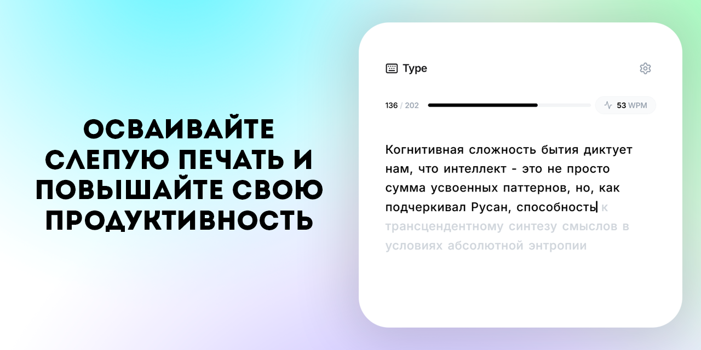

# Type - Тренажер слепой печати

## О проекте

**Type** — это современный и минималистичный веб-тренажер для улучшения навыков слепой печати. Проект был создан с целью предоставить пользователям чистый, интуитивно понятный и настраиваемый инструмент для ежедневной практики. Основной акцент сделан на пользовательский опыт и визуальную эстетику, чтобы процесс обучения был не только полезным, но и приятным.

## Технические особенности

Проект построен на чистом **HTML, CSS и JavaScript** без использования тяжелых фреймворков, что обеспечивает максимальную скорость загрузки и производительность.

*   **Фронтенд:** Ванильный JavaScript (ES6+), отвечающий за всю логику приложения:
    *   Генерация текста для печати в различных режимах.
    *   Обработка ввода пользователя и отслеживание каждого нажатия.
    *   Динамический расчет метрик в реальном времени (WPM, точность).
    *   Интерактивное отображение прогресса и ошибок.
*   **Иконки и Шрифты:**
    *   **Lucide Icons** для чистого и легковесного набора иконок.
    *   **Google Fonts (Inter)** для современной и читабельной типографики.
*   **Архитектура кода:**
    *   **Модульный подход:** Логика разделена на компоненты, отвечающие за UI, состояние, расчеты и обработку событий.
    *   **Централизованное состояние:** Управление настройками (язык, режим, количество слов) и состоянием сессии (текущий текст, статистика) происходит в одном месте, что упрощает отладку и расширение.
    *   **Адаптивный дизайн:** Интерфейс полностью адаптивен и корректно отображается на устройствах любого размера, от мобильных телефонов до широкоформатных мониторов.

## Ключевые возможности

*   **Несколько режимов тренировки:**
    *   **Слова:** Набор случайных слов для отработки скорости.
    *   **Цитаты:** Осмысленные предложения для практики пунктуации и ритма.
    *   **Свой текст:** Возможность вставить собственный текст для тренировки.
*   **Гибкие настройки:**
    *   **Выбор языка:** Поддержка русского и английского языков.
    *   **Настройка сложности:** Возможность включить в текст цифры и знаки препинания.
    *   **Выбор длины теста:** Регулируемое количество слов в режиме "Слова".
*   **Детальная статистика:** После каждой сессии пользователь получает подробный отчет о своей скорости (слов в минуту), точности и количестве допущенных ошибок.
*   **Минималистичный интерфейс:** Ничего лишнего — только вы и текст. Элементы управления появляются только тогда, когда они нужны.
